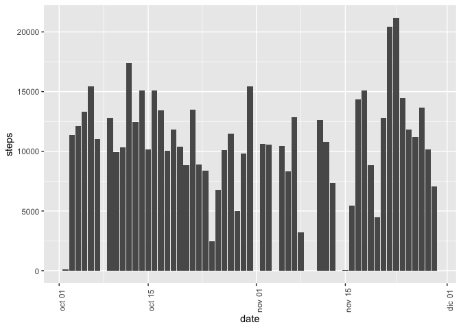
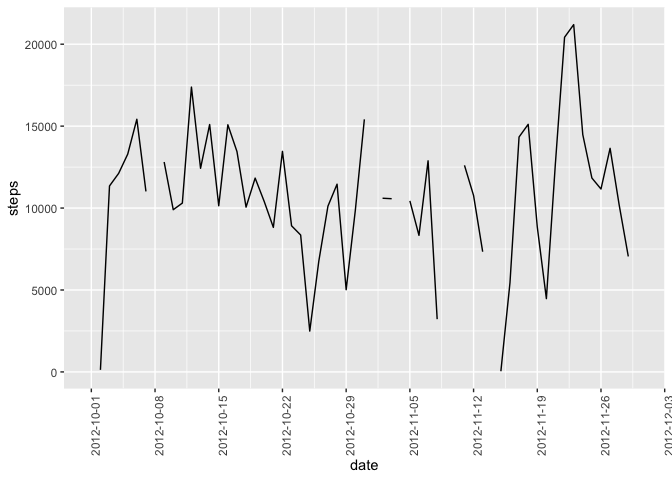
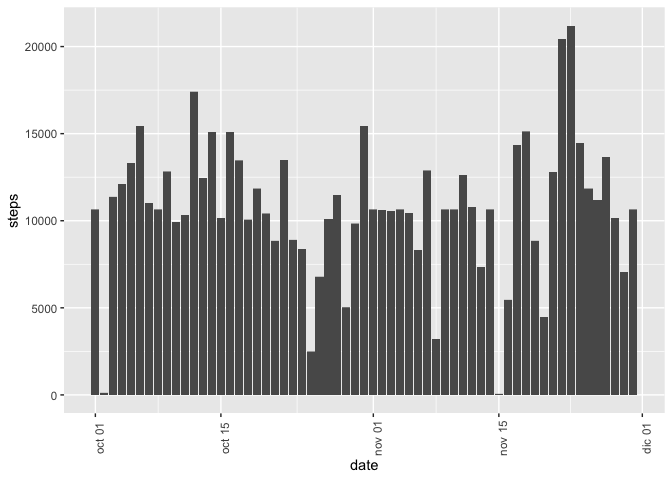
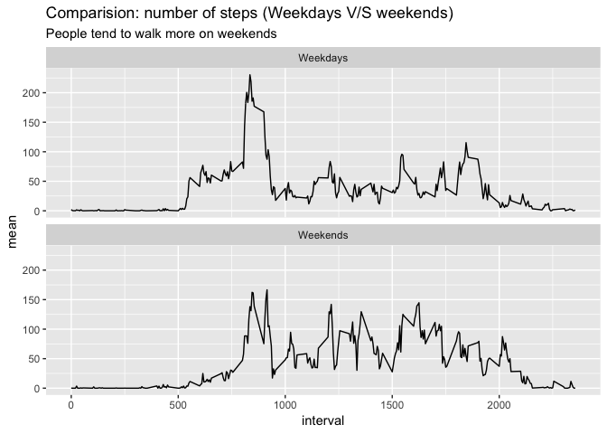

```r
knitr::opts_chunk$set(echo = TRUE)
```

```r
library(tidyverse)
library(lubridate)
```

## Programming assignment 1: reproducible research  

### 1. Code for reading in the dataset and/or processing the data

Download the "activity.csv" dataset


```r
zipUrl <- "https://d396qusza40orc.cloudfront.net/repdata%2Fdata%2Factivity.zip"
zipFile <- "repdata_data_activity.zip"
download.file(zipUrl, zipFile, mode = "wb")
unzip(zipFile)
```

Now we have tib_observations tibble object, and see a sample of 10 observations


```r
dataframe <- read.csv("activity.csv")
tib_observations <- as_tibble(dataframe)
tib_observations$date <- ymd(tib_observations$date)
head(tib_observations, 10)
```

```
## # A tibble: 10 x 3
##    steps date       interval
##    <int> <date>        <int>
##  1    NA 2012-10-01        0
##  2    NA 2012-10-01        5
##  3    NA 2012-10-01       10
##  4    NA 2012-10-01       15
##  5    NA 2012-10-01       20
##  6    NA 2012-10-01       25
##  7    NA 2012-10-01       30
##  8    NA 2012-10-01       35
##  9    NA 2012-10-01       40
## 10    NA 2012-10-01       45
```

### 2. Histogram of the total number of steps taken each day


```r
sum_steps <- tib_observations %>%
  group_by(date) %>%
  summarize(
    steps = sum(steps)
  )

ggplot(sum_steps, aes(date, steps)) +
  geom_bar(stat = "identity") +
  theme(axis.text.x = element_text(angle = 90))
```

```
## Warning: Removed 8 rows containing missing values (position_stack).
```

<!-- -->

### 3. Mean and median number of steps taken each day

We remove de NA values since we assume that there are no observations in that period of time.

Mean:

```r
mean(sum_steps$steps, na.rm = T) 
```

```
## [1] 10766.19
```

Median:

```r
median(sum_steps$steps, na.rm = T)
```

```
## [1] 10765
```

### 4. Time series plot of the average number of steps taken


```r
ggplot(sum_steps, aes(date, steps)) +
  geom_line() +
  scale_x_date(date_breaks = "1 week") +
  theme(axis.text.x = element_text(angle = 90))
```

```
## Warning: Removed 2 rows containing missing values (geom_path).
```

<!-- -->

### 5. The 5-minute interval that, on average, contains the maximum number of steps

```r
five_minute <- tib_observations %>%
  filter(!is.na(steps)) %>%
  group_by(interval) %>%
  summarize(
    average = mean(steps)
  ) %>%
  arrange(desc(average))

  head(five_minute, 1)
```

```
## # A tibble: 1 x 2
##   interval average
##      <int>   <dbl>
## 1      835    206.
```

The interval that, on average, contains de maximum number of steps is 8:35

### 6. Code to describe and show a strategy for imputing missing data

Total number of missing values:  


```r
tib_obsNA <- tib_observations %>%
filter(is.na(steps))
  
(count(tib_obsNA) * 100) / count(tib_observations)
```

```
##          n
## 1 13.11475
```
Total NAs are 2304 observations. They represent 13% of the whole sample.

Strategy for filling in all of the missing values in the dataset is using the mean for that 5-minute interval.


```r
#calculate means for every period in a separate table
tib_media_periodos <- tib_observations %>%
  group_by(interval) %>%
  summarize(
    mean = mean(steps, na.rm = T)
  )

#join means table with the main table
tib_medias <- left_join(tib_observations, tib_media_periodos)
```

```
## Joining, by = "interval"
```

```r
tib_medias$mean <- as.integer(tib_medias$mean)
#Replace NA Values
tib_medias$steps[is.na(tib_medias$steps)] <- tib_medias$mean[is.na(tib_medias$steps)]  

# Resulting table
tib_filled <- tib_medias %>%
  select(-mean)

head(tib_filled,10)
```

```
## # A tibble: 10 x 3
##    steps date       interval
##    <int> <date>        <int>
##  1     1 2012-10-01        0
##  2     0 2012-10-01        5
##  3     0 2012-10-01       10
##  4     0 2012-10-01       15
##  5     0 2012-10-01       20
##  6     2 2012-10-01       25
##  7     0 2012-10-01       30
##  8     0 2012-10-01       35
##  9     0 2012-10-01       40
## 10     1 2012-10-01       45
```


### 7. Histogram of the total number of steps taken each day after missing values are imputed


```r
tib_filled %>%
  group_by(date) %>%
  summarize(
    steps = sum(steps)
  )
```

```
## # A tibble: 61 x 2
##    date       steps
##    <date>     <int>
##  1 2012-10-01 10641
##  2 2012-10-02   126
##  3 2012-10-03 11352
##  4 2012-10-04 12116
##  5 2012-10-05 13294
##  6 2012-10-06 15420
##  7 2012-10-07 11015
##  8 2012-10-08 10641
##  9 2012-10-09 12811
## 10 2012-10-10  9900
## # … with 51 more rows
```

```r
ggplot(tib_filled, aes(date, steps)) +
  geom_bar(stat = "identity") +
  theme(axis.text.x = element_text(angle = 90))
```

<!-- -->

### 8. Panel plot comparing the average number of steps taken per 5-minute interval across weekdays and weekends


```r
# weekdays -> 2-6, weekends -> 1 or 7
tib_filled_wdays <- tib_filled %>%
  mutate(
    weekday = wday(date, label = T),
    weekday_int = wday(date),
    is_weekday = weekday_int %in% c(2:6) 
  )

tib_filled_wdays_summary <- tib_filled_wdays %>%
  group_by(interval, is_weekday) %>%
  summarize(
    mean = mean(steps)
  ) 

tib_filled_wdays_summary$is_weekday <- str_replace_all(tib_filled_wdays_summary$is_weekday, c("FALSE" = "Weekends", "TRUE" = "Weekdays"))


ggplot(data = tib_filled_wdays_summary) + 
  geom_line(mapping = aes(x = interval, y = mean)) +
  facet_wrap(~ is_weekday, nrow = 2, ncol = 1) + 
  labs(
    title = "Comparision: number of steps (Weekdays V/S weekends)",
    subtitle = "People tend to walk more on weekends"
  )
```

<!-- -->

